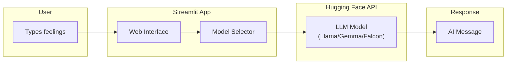

<p align="center">
  
  
  
  
</p>

<h1 align="center">MindChat GPT</h1>

<p align="center">
  <strong>An AI-powered mental wellness companion — talk about how you feel, get thoughtful responses</strong>
</p>

<p align="center">
  <a href="#-what-it-does">What It Does</a> •
  <a href="#-try-it-out">Try It Out</a> •
  <a href="#-models-available">Models</a> •
  <a href="#-setup">Setup</a>
</p>

---

## What It Does

MindChat GPT is a conversational AI tool designed to help you explore and express your mental state. Simply describe how you're feeling, and the AI will respond with thoughtful, supportive messages.

```
┌─────────────────────────────────────────────────────────────────────────────┐
│                                                                             │
│    You: "I've been feeling overwhelmed with work lately and can't sleep"   │
│                                                                             │
│                              ↓                                              │
│                                                                             │
│    AI: "It sounds like you're carrying a heavy load right now. Work        │
│         stress affecting sleep is very common. Consider setting            │
│         boundaries around work hours and trying a wind-down routine        │
│         before bed. Would you like to talk more about what's               │
│         specifically causing the overwhelm?"                                │
│                                                                             │
└─────────────────────────────────────────────────────────────────────────────┘
```

### Key Features

| Feature | Description |
|---------|-------------|
| **Multiple AI Models** | Choose from 4 different LLMs for varied response styles |
| **Simple Interface** | Clean Streamlit UI — just type and get responses |
| **Real-time** | Instant responses via Hugging Face Inference API |
| **Private** | No conversation history stored |

---

## Try It Out

### Live Demo

If deployed, access the app at your Streamlit URL.

### Local Preview

```bash
streamlit run streamlit_app.py
# Opens at http://localhost:8501
```

### How to Use

1. **Select a model** from the dropdown
2. **Type how you're feeling** in the text box
3. **Press Enter** and receive an AI response

---

## Models Available

Choose from 4 different AI personalities:

| Display Name | Actual Model | Style |
|--------------|--------------|-------|
| **distilgpt2** | Llama-3.2-1B-Instruct | Conversational, helpful |
| **bart** | Gemma-1.1-2b-it | Balanced, informative |
| **gpt-neo** | Gemma-1.1-2b-it | Thoughtful, detailed |
| **flan-t5** | Falcon-7b-instruct | Direct, instructive |

All models are accessed through the **Hugging Face Inference API** — no local GPU required.

---

## Setup

### Prerequisites

- Python 3.8+
- Hugging Face account (free) with API token

### Installation

```bash
# 1. Clone the repository
git clone https://github.com/Hussainm10/MindChat-GPT.git
cd MindChat-GPT

# 2. Install dependencies
pip install -r requirments.txt

# 3. Set up your API key
#    Create .streamlit/secrets.toml with:
#    [huggingface]
#    api_key = "your_huggingface_api_key"

# 4. Run the app
streamlit run streamlit_app.py
```

### Get Your Hugging Face API Key

1. Go to [huggingface.co](https://huggingface.co)
2. Create a free account
3. Navigate to Settings → Access Tokens
4. Create a new token with "read" permissions
5. Copy the token to your `secrets.toml` file

### Secrets File Format

Create `.streamlit/secrets.toml`:

```toml
[huggingface]
api_key = "hf_xxxxxxxxxxxxxxxxxxxxx"
```

---

## Project Structure

```
MindChat-GPT/
├── streamlit_app.py      # Main application
├── requirments.txt       # Python dependencies
├── .devcontainer/        # VS Code dev container config
│   └── devcontainer.json
└── README.md
```

---

## How It Works



### Tech Stack

| Component | Technology |
|-----------|------------|
| **Frontend** | Streamlit |
| **AI Models** | Llama 3.2, Gemma 1.1, Falcon 7B |
| **API** | Hugging Face Inference API |
| **Styling** | Custom CSS (dark theme) |

---

## Important Notes

| Note | Details |
|------|---------|
| **Not a replacement for professional help** | This is an AI tool for self-reflection, not therapy |
| **No data storage** | Conversations are not saved or logged |
| **API limits** | Free Hugging Face tier has rate limits |
| **Response quality varies** | Different models may give different quality responses |

---

## Deployment Options

### Streamlit Cloud (Recommended)

1. Push your code to GitHub
2. Go to [share.streamlit.io](https://share.streamlit.io)
3. Connect your repo
4. Add your Hugging Face API key in Streamlit secrets
5. Deploy

### Google Colab + LocalTunnel

```python
!pip install streamlit
!npm install -g localtunnel
!streamlit run streamlit_app.py & npx localtunnel --port 8501
```

---

## Author

<p>
  <b>Hussain Mansoor Bhutto</b> — Architect & Developer<br/>
  <a href="https://github.com/Hussainm10">GitHub</a> •
  <a href="https://www.linkedin.com/in/hussainmansoorbhutto/">LinkedIn</a>
</p>

---

## License

MIT License — use freely for personal and educational purposes.

---

<p align="center">
  <sub>Your feelings matter. Let AI help you explore them.</sub>
</p>
